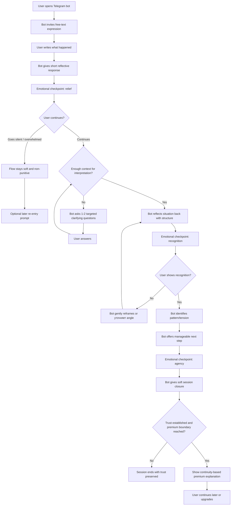
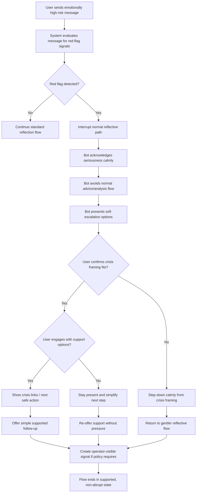
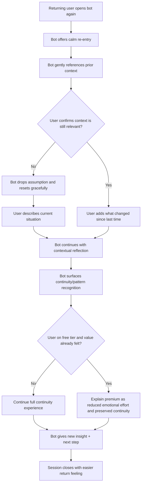

# UX Design Specification goals

**Author:** Bratan
**Date:** 2026-03-10

---

<!-- UX design content will be appended sequentially through collaborative workflow steps -->

## Executive Summary

### Project Vision

goals is a Telegram-first conversational product designed to help users calmly unpack acute conflicts and moments of emotional overload. From a UX perspective, the product is not a therapy substitute and not a generic AI chat. Its core promise is to help users `разобраться` in a difficult situation quickly, safely, and without judgment.

The first-use experience must reduce friction and emotional tension immediately. The experience should begin with expression, not configuration: the user should be able to start by simply describing what happened. The repeat-use experience must make continuity between sessions feel valuable and natural rather than invasive. Great UX in this product means transforming a messy emotional state into a calmer, more structured interaction that feels humane, trustworthy, and useful.

### Target Users

The primary UX target is a user in acute interpersonal conflict, especially relationship conflict, who needs immediate clarity and does not want to wait for a psychologist, burden a friend, or read generic AI output. A secondary user is someone who returns in calmer moments because the product remembers important context and supports reflective continuity.

The most important primary persona is a relationship-conflict user like Masha: emotionally overloaded, slightly ashamed to repeat the story to friends, and looking for a neutral space that helps her understand what happened. A critical edge-case persona is the red-flag user, where the experience must safely shift from normal reflection to soft escalation.

### Key Design Challenges

- Create a first-run experience that feels immediately safe and useful without turning into an interrogation or forcing early product choices.
- Balance warmth and structure so the product feels human, but still delivers a clear breakdown of the situation.
- Integrate continuity, paywall, and red-flag handling without damaging trust.
- Preserve a non-medical tone while still feeling serious and competent in emotionally sensitive moments.

### Design Opportunities

- Use Telegram's familiar messaging environment to make the experience feel immediate and low-friction.
- Build the product language around `разобраться` rather than `поговорить`, giving the UX a sharper emotional fit.
- Make continuity between sessions feel like quiet support rather than surveillance, with room for correction when memory is wrong.
- Turn the end of each session into a moment of relief, orientation, and next-step clarity rather than just a generated summary.

## Core User Experience

### Defining Experience

The core experience of goals is simple: the user writes what happened, and the product helps them make sense of it. This is the primary recurring action and the center of the entire UX. Everything else exists to support this moment.

The single most important interaction to get right is the bot's first meaningful response after the user has expressed the situation. That response determines trust. It should not begin with advice. It should begin with a short human reflection, then offer a structured interpretation of what happened, and only then guide the conversation forward. If the response feels accurate, warm, nonjudgmental, and grounded in the user's emotional context, the user continues. If it feels generic, rushed, or prematurely advice-driven, the user is likely to disengage immediately.

From a UX perspective, the product should feel less like navigating a tool and more like entering a familiar conversational space where clarity begins quickly.

### Platform Strategy

The core product surface is Telegram only. The UX should be designed natively for Telegram behaviors rather than treating Telegram as a temporary delivery wrapper.

The primary interaction model is text-first. The core conversation flow should work through normal chat behavior, not through menu-heavy interaction. Inline buttons may be used for support functions such as payment actions or lightweight branching, but they should not replace the main conversational experience. Explicit mode selection should not dominate the first-run experience; the default UX should privilege immediacy over configuration.

Platform constraints that should shape the UX include:
- users cannot easily revise the emotional meaning of already-sent messages, so the bot must respond carefully to imperfect or messy input;
- long bot messages should be broken into readable chunks rather than delivered as a wall of text;
- typing indicators are important for maintaining the feeling of a live and attentive response.

### Effortless Interactions

The beginning of a session should feel effortless. Users should not face setup, configuration, onboarding questionnaires, or early product decisions before they are able to express what happened.

The product should make the following feel natural and low-friction:
- starting a session by simply writing the situation;
- receiving a first response without needing to choose a complex mode;
- continuing a conversation without repeating context from previous sessions;
- understanding what to do next at the end of the session.

The desired feeling is that the product was already there when the user needed it.

### Critical Success Moments

The first-time success moment happens when the bot formulates the situation more clearly than the user could on their own. In this product, that usually happens around the fourth to sixth message of the first session.

The "better than a friend" moment happens when the user receives structure and a next step rather than sympathy, projection, or vague comfort.

The most destructive failure moments are:
- the bot gives advice before it has listened enough;
- the response feels template-driven;
- the bot misses the emotional or relational context of the situation.

In a high-trust emotional product, the first broken moment may permanently damage user confidence.

### Experience Principles

- Start with expression, not configuration.
- The first meaningful response is the trust-making moment.
- Text is the primary interface; buttons are support, not the product.
- Structure must arrive without emotional coldness.
- Continuity should reduce effort without feeling invasive.
- Memory should feel tentative and correctable, not omniscient.
- Safety transitions must feel supportive, not like system failure.
- Every session should end with orientation, not just output.

## Desired Emotional Response

### Primary Emotional Goals

The primary emotional goal of goals is to help the user move from emotional overload to calm clarity with a renewed sense of agency. The product should feel like a steady, humane space where the user can exhale, speak honestly, and gradually see the situation more clearly.

The product should not create dependency through authority. Instead, it should support the feeling that the user arrived at clarity with help, not that the bot “solved” their life for them. The best emotional outcome is relief combined with a renewed sense of inner agency.

### Emotional Journey Mapping

**At the beginning of the session:**  
The user should feel that the space is already open and available to them. There should be no strong sense of entering a system, proving legitimacy, or introducing themselves. The emotional effect should be: “I can exhale here and just say what happened.”

**During the core interaction:**  
The user should feel heard, not judged. The product should create the impression of a calm, intelligent presence that helps sort the situation out without lecturing, interrupting, or rushing to advice. The dominant feeling should be: “Someone understands what I’m trying to say, and we’re making this clearer together.”

**At the end of the session:**  
The user should feel lighter, clearer, and more internally organized. The ideal outcome is not necessarily certainty or resolution, but the reduction of emotional fog and the feeling that the thread has not been lost. The product should preserve the sense that the insight belongs to the user. The emotional effect should be: “It feels clearer now, and I can take the next step.”

**When returning later:**  
The user should feel remembered in a supportive way. Continuity between sessions should reduce emotional effort and repetition without feeling invasive. The effect should be: “I don’t have to start from zero again.”

### Micro-Emotions

The most important micro-emotions for this product are:

- exhale / release instead of guardedness;
- trust instead of skepticism;
- being understood instead of being evaluated;
- clarity instead of confusion;
- groundedness instead of emotional acceleration;
- supported agency instead of passive dependence.

These micro-emotions matter because the product succeeds not only when it gives useful output, but when the user feels safer, steadier, and more internally organized while receiving it.

### Design Implications

If the product should make users feel safe and unjudged, the UX should avoid hard system language, abrupt branching, and advice-first responses.

If the product should make users feel understood, the first meaningful reply should reflect and organize the user’s experience before steering them.

If the product should make users feel agency rather than control, the conversation should feel collaborative rather than script-enforced. The user should feel that they are leading the content of the conversation even when the bot is guiding the structure.

If the product should make return usage feel natural, memory should be presented gently and with humility rather than certainty or surveillance-like confidence.

If the product should reduce emotional fog, the end of the session should create closure, orientation, and a manageable next step rather than a cold generated recap.

These emotional goals also depend on system behavior: latency, memory correctness, and escalation reliability directly shape whether the experience feels calming, trustworthy, and supportive.

### Emotional Design Principles

- Create the feeling of arrival without ceremony.
- Help the user feel heard before helping them feel guided.
- Reduce emotional temperature, not just informational uncertainty.
- Preserve the user’s sense of authorship over the insight.
- Make continuity feel supportive, not invasive.
- Never let the product imply blame, pathology, or moral judgment.
- Never let the user feel like a case being classified.
- Avoid emotional residue that leaves the user more anxious than before.
- Design every trust surface as if confidence may be lost permanently after one bad interaction.

## UX Pattern Analysis & Inspiration

### Inspiring Products Analysis

**Replika**  
Replika is useful as an example of emotional warmth at the start of a conversation. It creates the feeling that the user is welcome immediately, without cold onboarding or system friction. It also demonstrates how accumulated context can drive return behavior over time.

For goals, the transferable value is not the “AI companion” fantasy, but the emotional softness of the opening and the feeling that continuity exists. What should not be adopted is over-personification, romantic tone, or any dynamic that makes the relationship with the bot feel emotionally substitutive rather than supportive.

**Woebot**  
Woebot is a strong reference for structured conversation that still feels readable and approachable. It shows how a reflective framework can sit behind ordinary language, and how safety-sensitive interactions can be handled with calmness rather than alarm.

For goals, the key inspiration is hidden structure: the user should feel like they are in a natural conversation even when the product is following a clear method. What should not be adopted is an overly clinical or exercise-like tone that makes the interaction feel like homework instead of reflection.

**ChatGPT**  
ChatGPT is relevant as a conversational benchmark. Users already understand the pattern of typing freely and getting a response with almost no onboarding or explanation. This low-friction expectation is especially important in moments of emotional overload.

For goals, the main lesson is immediate entry and familiarity of interaction. What should not be adopted is lack of continuity, excessive neutrality, or long walls of text that weaken the emotional usefulness of the exchange.

**Duolingo**  
Duolingo is useful as a monetization and timing reference. It introduces paywall pressure after users have already experienced value, rather than before trust is established.

For goals, this supports the principle that payment should follow relief and continuity value, not block the first useful moment. It should not inspire reward psychology around emotional distress.

**Notion AI**  
Notion AI is relevant for the feeling of an intelligent assistant that helps fluidly without forcing the user through a rigid or over-explained flow.

For goals, this supports the idea that structure should feel embedded and lightweight rather than scripted and visible.

**Signal**  
Signal is useful as a product-trust reference. It treats privacy as part of the product promise, not just as a technical backend feature.

For goals, this supports designing privacy as a visible trust surface, especially in a product dealing with sensitive conversations. Trust cues should only be borrowed to the degree that the product can support them operationally.

### Transferable UX Patterns

**Easy Wins**
- warm conversational entry without cold onboarding;
- zero-friction "write -> receive response" behavior;
- chunked and readable bot replies instead of walls of text;
- value-first paywall timing;
- assistant-like guidance that does not feel over-scripted.

**Careful Adaptations**
- continuity between sessions as a soft retention layer;
- memory cues that feel supportive rather than omniscient;
- hidden reflective structure beneath natural language;
- safety-sensitive transitions that remain calm and humane;
- privacy signals that are visible, but proportionate to real product behavior.

**Hard No**
- over-personifying the bot to the point where it feels emotionally substitutive or romantic;
- letting structure become too clinical, therapeutic, or exercise-like;
- using long, dense answer blocks that feel like generated essays instead of attentive conversation;
- inserting paywall friction before the user experiences trust and relief;
- making memory feel creepy, overly confident, or surveillance-like;
- using cold system language in emotionally sensitive moments;
- gamifying emotional pain through streaks, badges, or compulsion loops.

### Anti-Patterns to Avoid

- Romance, dependence, or companion fantasy.
- Therapy-coded exercises as the dominant interaction style.
- Walls of text and emotionally flat responses.
- Early monetization pressure.
- Surveillance-like memory UX.
- Privacy messaging that is technically correct but experientially invisible.
- Reward loops that exploit emotional vulnerability instead of supporting reflection.

### Design Inspiration Strategy

**What to Adopt**
- Replika's warmth of entry, without relationship simulation.
- Woebot's hidden structure and calm safety behavior.
- ChatGPT's zero-friction interaction pattern and blank-canvas familiarity.
- Duolingo's value-first paywall timing.
- Notion AI's lightweight assistant feel.
- Signal's product-level privacy trust posture.

**What to Adapt**
- Continuity patterns should be softer and more humble than Replika.
- Structured reflection should feel less clinical than Woebot.
- Conversational simplicity should be warmer and less verbose than ChatGPT.
- Premium conversion should be tied to continuity and emotional effort reduction, not just content limits.

**What to Avoid**
- Whole-product copying from any single reference.
- Romance, dependence, or emotional simulation.
- Therapy-coded drills as the default conversation style.
- Early monetization pressure.
- Surveillance-like memory behavior.
- Gamified loops around vulnerability or distress.

## Design System Foundation

### 1.1 Design System Choice

For the MVP, goals should use a **hybrid design system strategy** with a clear primary layer: a **Conversational Design System** tailored to Telegram. The product does not need a traditional visual component library as its main design foundation because the core user experience lives inside a messaging interface, not inside a custom web UI.

A standard supporting UI system may be reserved for a future web layer, paywall pages, or admin surfaces, but it should not drive the MVP experience. The current design system of record should be the conversational layer, not a component library.

### Rationale for Selection

This choice fits the product because:
- speed matters more than visual uniqueness in MVP;
- the product's differentiation lives in tone, structure, and emotional pacing rather than interface chrome;
- Telegram already provides much of the surrounding interface shell;
- consistency in message behavior matters more than consistency in custom UI widgets at this stage.

The strongest UX advantage in this product will come from how the conversation feels, not from how a custom interface looks. Therefore, the design system must prioritize conversation structure, response formatting, interaction controls, and trust-preserving language.

### Implementation Approach

The MVP design system should be defined as a **Conversational Design System**, including governed rules for:

- message template taxonomy for key conversation states:
  - listening
  - clarification
  - reflection / breakdown
  - next-step guidance
  - session closure
  - red-flag escalation
- message chunking and length behavior for Telegram readability;
- button policy that defines when inline keyboards are appropriate and when text-only interaction should remain uninterrupted;
- tone tokens that define warmth, neutrality, emotional restraint, and nonjudgmental phrasing in a usable and repeatable way;
- memory cue patterns that reference continuity gently and tentatively;
- escalation copy patterns that support crisis-sensitive interaction without panic, coldness, or clinical detachment.

This approach creates a repeatable UX foundation for a Telegram product without overcommitting to visual infrastructure that the MVP does not need.

### Customization Strategy

Customization in MVP should focus on **conversational consistency**, not visual novelty.

The current system should standardize:
- how a message opens;
- how long messages are chunked;
- how empathy is expressed without sounding therapeutic or scripted;
- how memory is referenced without sounding invasive;
- how the session closes with relief and orientation;
- how payment and premium value are explained without disrupting trust;
- how support actions use buttons without interrupting emotional flow.

A future supporting UI layer may later adopt a standard system such as Tailwind-based patterns or MUI for web/admin surfaces, but that layer should remain explicitly out of current UX scope.

## 2. Core User Experience

### 2.1 Defining Experience

The defining experience of goals is this: the user writes what happened, and the product helps them see the situation more clearly than they could on their own. The value is not in receiving immediate advice, but in reaching a moment of recognition through structured reflection.

If users describe the product to a friend, the experience may sound like this: "It's like venting to a smart friend who doesn't give advice, but helps you understand it yourself." This is useful as a user-facing description, but the deeper UX value is reflective clarity rather than companionship.

The defining success moment is when the user reads the bot's interpretation and feels: "Yes, that's exactly what this is." This recognition should happen without shame, pressure, or the feeling of being judged. That moment is the heart of the experience.

### 2.2 User Mental Model

The most accurate mental model for this product is **a mirror with intelligence**. The user should not feel like they are talking to a therapist, taking instructions from an assistant, or forming a bond with a companion. They should feel that the product reflects their situation back in a cleaner, more structured, more legible way.

This matters because the product should preserve ownership of insight. The user should feel that the realization is their own, even though the bot helped make it visible. The UX should reinforce this model through reflective language, nonjudgmental structure, and an absence of forced authority.

### 2.3 Success Criteria

The core interaction succeeds when:

- the user feels understood without being judged;
- the bot articulates a feeling, pattern, or tension the user had not been able to name clearly;
- the user experiences a moment of recognition: "Yes, that's it";
- the user leaves with more clarity and readiness for a manageable next step;
- the experience feels lighter and more useful than talking to a friend or receiving generic AI output.

The strongest signal that the interaction works is not delight in the interface, but recognition in the mind of the user followed by small forward movement.

### 2.4 Novel UX Patterns

The core interaction uses a **familiar pattern with a new twist**.

The familiar pattern is ordinary chat: the user writes freely and receives a response. This lowers the barrier to entry and matches what users already know from Telegram and general-purpose AI tools.

The twist is in the behavior of the product:
- it does not rush to answer;
- it clarifies before advising;
- it reflects before concluding;
- it remembers prior context in later sessions.

The system earns the right to interpret by listening first. This makes the experience feel both familiar and distinct: easy to enter, but meaningfully different in value.

### 2.5 Experience Mechanics

**1. Initiation**  
The user starts by writing what happened in free text. No command syntax, no setup, no menu-first interaction. The experience begins with expression.

**2. Interaction**  
The bot responds progressively, not interrogatively. It clarifies the situation with targeted questions and reflective prompts, without interrupting too early with advice. The interaction should feel structured, but not controlling.

**3. Feedback**  
The bot reflects the situation back in a more structured form, surfaces an emotional or relational pattern, and offers a manageable next step. This is where the product creates the "you named what I couldn't" moment.

**4. Completion**  
The session ends with a soft landing: a short takeaway, a clearer understanding of the situation, and a small forward step. The completion should feel like orientation, not termination.

## Visual Design Foundation

### Color System

The visual direction for goals should be defined by **quiet warmth**. The product should feel calm, grounded, and emotionally non-intrusive rather than bright, stimulating, clinical, or lifestyle-decorative.

The preferred palette direction is built around warm neutrals:
- soft beige and warm off-white base surfaces;
- warm gray for text hierarchy and structural emphasis;
- muted terracotta or sage as restrained accent colors;
- restrained high-clarity alert treatment reserved for explicit risk or warning states.

The system should explicitly avoid:
- bright purple;
- clinical blue;
- saturated red as a dominant UI signal;
- playful or gamified color behavior.

This color strategy should reduce visual tension and emotional noise while preserving trust and readability.

### Typography System

Typography should feel calm with warmth. Readability is the highest priority.

The system should use a clean, rounded sans-serif style in the spirit of fonts such as Inter or Nunito: soft enough to feel humane, structured enough to remain clear over long conversational reading. Typography should not feel corporate, sharp, or overly technical.

The typography strategy should emphasize:
- highly readable body text for long chat sessions;
- soft but clear hierarchy for summaries, prompts, and support content;
- minimal stylistic contrast;
- no monospaced accents in the primary experience.

### Spacing & Layout Foundation

For owned surfaces, the spacing strategy should feel airy and calm. Dense layouts would undermine the sense of safety and make emotionally heavy interaction feel cognitively crowded.

The base spacing rhythm should be spacious rather than compact. This should guide:
- spacing around summaries and structured sections;
- breathing room around trust-sensitive moments such as paywall prompts and escalation states;
- separation between interaction zones on future owned surfaces.

For Telegram in-chat UX, “spacing” should be interpreted primarily as formatting rhythm rather than screen layout control. In practice, this means:
- chunking long replies into readable blocks;
- avoiding wall-of-text responses;
- using paragraph separation deliberately;
- keeping button placement from crowding emotionally sensitive message content.

### Accessibility Considerations

Accessibility in this product is closely tied to emotional readability, not only technical compliance.

The visual and formatting system should prioritize:
- strong readability over stylistic expression;
- sufficient contrast within a warm-neutral palette;
- comfortable text sizing for prolonged reading;
- chunked presentation of long content to reduce scanning fatigue;
- restrained accent use so important actions and safety states remain legible without creating alarm spikes.

Because the product is text-first and emotionally sensitive, readability and cognitive ease are core accessibility requirements, not secondary polish.

## Design Direction Decision

### Design Directions Explored

For goals, six design directions were explored within the same Telegram-first UX foundation.

**Direction 1: Quiet Mirror**  
A very soft, low-pressure direction with minimal visual weight and maximum emotional spaciousness. This direction prioritizes calm entry, subtle structure, and reflective trust.

**Direction 2: Structured Warmth**  
A balanced direction that combines emotional warmth with more visible conversational structure. This makes the flow feel supportive while still clearly guiding the user toward clarity.

**Direction 3: Soft Analyst**  
A more intellectually structured direction that increases the sense of clarity and interpretive precision without becoming clinical. It is calmer and more serious, with a slightly stronger analytical feel.

**Direction 4: Companion Light**  
A warmer and more obviously human-feeling direction that emphasizes emotional accessibility and low defensiveness. It avoids romance and dependency, but sits closest to a “warm presence” interaction style.

**Direction 5: Continuity Premium**  
A direction that makes continuity between sessions and memory-driven value more visible. It is especially useful for expressing premium value, repeat-use ease, and reduced emotional setup cost.

**Direction 6: Safety First Calm**  
A direction focused on crisis-sensitive trust surfaces, especially soft escalation and red-flag handling. It shows how the product can remain humane and steady even when normal reflective flow must shift.

### Chosen Direction

The chosen direction is a deliberate hybrid with a clear default:

- **Primary default direction:** `Structured Warmth`
- **Entry influence:** `Quiet Mirror`
- **Continuity and premium influence:** `Continuity Premium`
- **Safety and escalation influence:** `Safety First Calm`

This means the product will not use one flat visual-emotional mode for every situation. Instead, it will use a stable core direction and specialized trust-sensitive variations for the moments that need them.

### Design Rationale

`Structured Warmth` is the strongest default because it best expresses the core UX promise of goals: helping the user feel understood and then helping them see their situation more clearly without emotional coldness or therapeutic role-play.

`Quiet Mirror` is retained as an influence on first-run and entry-state interactions because it lowers emotional defensiveness and supports the feeling that the user can simply exhale and begin.

`Continuity Premium` is retained for repeat-use and monetization moments because it most clearly communicates the value of not having to restate context, patterns, and relationship history in later sessions.

`Safety First Calm` is retained for red-flag and crisis-sensitive flows because it shows how escalation can remain humane, calm, and trust-preserving instead of abrupt or system-like.

The rejected primary directions were rejected for specific reasons:
- `Companion Light` is useful as a warmth ceiling, but too risky as a default because it can blur the boundary between reflective support and companion-like attachment.
- `Soft Analyst` is useful as a clarity reference, but too close to emotional coldness if made primary.

Overall, the selected direction supports the product’s defining UX: structure without coldness, warmth without role confusion, continuity without creepiness, and safety without rejection.

### Implementation Approach

The design direction should be implemented as a layered conversational style system.

Recommended implementation approach:
- use **Structured Warmth** as the default style for the main session flow;
- borrow the low-pressure entry softness of **Quiet Mirror** for first message pacing, emotional arrival, and low-friction session start;
- use **Continuity Premium** selectively in second-session entry, memory references, and paywall/premium explanation moments;
- use **Safety First Calm** as the dedicated pattern library for red-flag detection, escalation copy, and support-resource presentation;
- keep all directions within the same quiet-warmth visual foundation, text-first Telegram formatting model, and non-medical trust posture.

This creates one coherent UX system with different emotional weights for different moments, rather than a fragmented set of competing styles.

## User Journey Flows

### Маша - Acute Conflict Reflection Flow

This is the primary success-path journey. The goal of the flow is to move the user from emotional overload to clarity with minimal friction and without early advice.

Key UX requirements in this flow:
- immediate start with no setup burden;
- first meaningful response must create trust and initial relief;
- clarification must feel progressive, not interrogative;
- the user must reach a recognition moment before the session closes;
- the flow should end with a soft landing and one manageable next step;
- the user must be able to pause or go silent without the session turning punitive or broken.

**Potential confusion points:**
- the first bot response sounds too generic;
- the clarifying questions feel like interrogation;
- the reflective breakdown arrives too late;
- the next step feels too prescriptive rather than manageable;
- silence is treated like abandonment instead of overload.

**Recovery expectations:**
- if the first reflection misses, the bot should narrow and restate rather than jump to advice;
- if the user gives messy or emotional input, the flow should tolerate ambiguity;
- if the user hesitates or goes silent, the system should preserve dignity and make re-entry easy.

### Red-Flag User - Soft Escalation Flow

This is the most critical trust and safety flow. The goal is not a successful reflective session, but a humane transition from normal conversation into a supportive escalation path.

Key UX requirements in this flow:
- crisis signals must interrupt the normal interpretation flow;
- escalation must feel supportive, not like rejection;
- the user should still feel seen and accompanied;
- the next step must be clearer and safer than “you need help”;
- if the detection was too strong, the flow must be able to step back gracefully.

**Potential confusion points:**
- escalation sounds cold or legalistic;
- the transition feels like a system error instead of care;
- too many urgent actions appear at once;
- the system cannot recover gracefully from a false positive.

**Recovery expectations:**
- if the user ignores first escalation options, the bot should simplify rather than intensify;
- if the user remains in conversation, the system should stay steady and non-lecturing;
- if the red-flag interpretation was too strong, the flow should step down without shame or friction;
- the flow should never dump the user into silence after escalation.

### Лена - Continuity and Return Flow

This is the retention journey. The goal is to reduce emotional setup cost and make repeat use feel meaningfully easier than the first session.

Key UX requirements in this flow:
- returning should feel lighter than starting over;
- continuity should be visible, but tentative and non-creepy;
- memory should reduce effort, not dominate the conversation;
- premium value should feel like easier return and preserved context, not simple feature withholding;
- calm-period use should still feel worthwhile.

**Potential confusion points:**
- memory recall feels too certain or too personal;
- the user feels misremembered;
- paywall interrupts before continuity value is felt;
- repeat session feels too similar to first-time use.

**Recovery expectations:**
- if memory is wrong, the user should be able to implicitly correct it by replying, and the bot should yield immediately;
- continuity cues should be phrased as tentative, not omniscient;
- even if premium is declined, the reflection experience should remain coherent and useful.

### Journey Patterns

Across these flows, several reusable UX patterns appear consistently.

**Entry Patterns**
- Start with expression, not setup.
- Assume the user is in a state, not in a product exploration mindset.
- Reduce the emotional cost of first input as much as possible.

**Conversation Patterns**
- First meaningful response must reflect before it interprets.
- Clarification should be progressive, not interrogative.
- Structure should emerge gradually rather than appear as a rigid framework.
- Relief, recognition, and agency should appear as distinct checkpoints within the flow.

**Continuity Patterns**
- Memory should be surfaced gently and tentatively.
- Continuity should reduce repetition and emotional setup cost.
- The user must be able to override or redirect remembered context naturally.

**Safety Patterns**
- Red-flag detection must interrupt normal reflection flow.
- Escalation must preserve dignity and human tone.
- Crisis-sensitive moments require fewer, clearer choices, not more.
- Strong detections must support graceful step-down when the interpretation does not fit.

**Monetization Patterns**
- Paywall should appear after felt value, not before trust.
- Premium should be framed as preserved continuity and easier return, not raw volume.
- Repeat-use value should be emotionally legible before it becomes commercial.

**Operational Separation Pattern**
- Operator mechanics and alerting must not leak into the user-facing emotional flow.

### Flow Optimization Principles

- Minimize steps to emotional relief, not just to task completion.
- Protect the first meaningful response as the core trust-making moment.
- Keep branch complexity away from the first-run experience.
- Prefer progressive disclosure over visible system logic.
- Reduce emotional setup cost on every return session.
- Use closure as a soft landing, not just a generated endpoint.
- Treat safety transitions as first-class flows, not edge interruptions.
- Let premium value emerge from reduced friction and remembered context.
- Respect silence as part of emotional processing, not only as abandonment.

## Component Strategy

### Design System Components

The foundation for goals is not a traditional UI component library. The current design system provides behavioral and formatting primitives for Telegram-first interaction:

- message template taxonomy;
- chunked response formatting;
- tone tokens;
- button usage rules;
- memory cue patterns;
- escalation copy patterns;
- closure patterns.

These are the reusable base elements already available from the Conversational Design System. They define how the product speaks, reveals structure, handles trust-sensitive moments, and formats content in chat.

For the MVP, standard visual UI components are not the main design surface. Instead, the main foundation components are conversational primitives plus a small set of support control components.

### Custom Components

The component strategy should distinguish between:

- **Primary Conversation Components** — components that carry the reflective value of the product;
- **Support Control Components** — components that assist control, branching, payment, or re-entry without replacing the conversation itself.

### Primary Conversation Components

#### Reflective Message Block

**Purpose:**  
Reflect the user’s situation back in a warmer, clearer, more structured form so the user feels understood before being guided.

**Usage:**  
Used early in the flow, usually after the user’s first input or after a clarification turn. This is the primary trust-making component.

**Anatomy:**  
- short human reflection;
- one structured observation or reframing;
- optionally a gentle bridge into the next conversational move.

**States:**  
- default;
- memory-informed variant;
- corrected variant after user clarification.

**Variants:**  
- first-response reflective block;
- mid-session reflective block;
- repeat-session reflective block.

**Accessibility:**  
- must remain short enough for easy scanning;
- must avoid overloaded paragraphs;
- must preserve readability in chunked format.

**Content Guidelines:**  
Should sound calm, precise, and nonjudgmental. Must not jump into advice before establishing understanding.

**Interaction Behavior:**  
Pure text component. No inline buttons by default.

#### Clarification Prompt Block

**Purpose:**  
Ask a targeted follow-up that reduces ambiguity without making the conversation feel like an interrogation.

**Usage:**  
Used when the system lacks enough context to produce a responsible interpretation.

**Anatomy:**  
- short framing sentence;
- one focused question;
- optional low-pressure framing if the user is emotionally overloaded.

**States:**  
- default;
- silence-aware variant;
- narrowed follow-up variant.

**Variants:**  
- fact clarification;
- emotional clarification;
- pattern clarification.

**Accessibility:**  
Questions must be short, readable, and not stacked in dense batches.

**Content Guidelines:**  
One question at a time whenever possible. Avoid multi-part interrogation.

**Interaction Behavior:**  
Usually text-only. Inline choices may be used only when they reduce cognitive load without shrinking emotional nuance.

#### Structured Takeaway Block

**Purpose:**  
Give the user a concise, legible sense of what became clearer during the session.

**Usage:**  
Used near the end of a successful reflection flow, usually paired with the Next-Step Block as part of session closure.

**Anatomy:**  
- short orienting statement;
- distilled understanding of the situation;
- emotional or relational pattern if relevant.

**States:**  
- default;
- memory-informed variant;
- premium continuity variant.

**Variants:**  
- short takeaway;
- slightly richer takeaway for deep mode.

**Accessibility:**  
Must be easy to skim and not read like a generated report.

**Content Guidelines:**  
Should feel like orientation, not verdict.

**Interaction Behavior:**  
Text-only.

#### Next-Step Block

**Purpose:**  
Offer one manageable next step so the user leaves with agency, not just insight.

**Usage:**  
Immediately after the Structured Takeaway Block or as part of paired session closure.

**Anatomy:**  
- one suggested next step;
- optional framing that keeps the step small and non-coercive.

**States:**  
- default;
- cautious variant;
- defer-action variant when “do nothing yet” is the best next step.

**Variants:**  
- say something;
- ask something;
- pause and not act yet;
- notice a pattern before acting.

**Accessibility:**  
Must remain concise and emotionally digestible.

**Content Guidelines:**  
Should feel invitational, not commanding.

**Interaction Behavior:**  
Text-first. Can be followed by optional support buttons only if they clearly reduce friction.

#### Continuity Recall Cue

**Purpose:**  
Signal that the product remembers important context from earlier sessions and reduce emotional setup cost.

**Usage:**  
Used at the beginning of a return session or when prior context is genuinely relevant.

**Anatomy:**  
- tentative memory reference;
- soft confirmation framing;
- invitation to correct or update.

**States:**  
- default;
- low-confidence memory;
- corrected memory;
- premium continuity variant.

**Variants:**  
- relationship context cue;
- recurring pattern cue;
- prior unresolved issue cue.

**Accessibility:**  
Must be readable and emotionally light.

**Content Guidelines:**  
Never omniscient. Must sound tentative, not absolute.

**Interaction Behavior:**  
Primarily text. Can be followed by low-risk buttons only if they simplify re-entry.

#### Soft Escalation Block

**Purpose:**  
Handle red-flag moments in a humane, supportive, and non-panicked way.

**Usage:**  
Used when the standard reflection flow must be interrupted due to safety-sensitive signals.

**Anatomy:**  
- acknowledgment of seriousness;
- calming and non-rejecting tone;
- simple next support option;
- optional resource CTA.

**States:**  
- warning;
- active escalation;
- user-declines-support;
- step-down / false-positive recovery.

**Variants:**  
- high concern;
- ambiguous concern;
- resource-forward variant;
- stay-with-user variant.

**Accessibility:**  
Must prioritize clarity, calm pacing, and low cognitive burden.

**Content Guidelines:**  
Must never sound legalistic, cold, or alarmist.

**Interaction Behavior:**  
Text-first with carefully limited support buttons.

#### Re-entry Prompt

**Purpose:**  
Make it easy to return after silence or after a pause between sessions without shame or friction.

**Usage:**  
Used when the user goes quiet mid-flow or returns later and needs a low-pressure way back in.

**Anatomy:**  
- low-pressure re-entry sentence;
- small continuation choices if useful.

**States:**  
- silence/re-entry;
- resumed conversation;
- new-topic variant.

**Variants:**  
- continue this thread;
- start fresh;
- gentle reminder;
- return after pause.

**Accessibility:**  
Must not imply failure or abandonment.

**Content Guidelines:**  
Should sound welcoming, not nagging.

**Interaction Behavior:**  
May use inline buttons such as `Continue` / `New topic`.

### Support Control Components

#### Mode Selector

**Purpose:**  
Allow the user to choose between fast and deep reflection when explicit control is useful.

**Usage:**  
Used only as a support surface. It should not dominate first-run interaction.

**Anatomy:**  
- short framing line;
- two low-friction options.

**States:**  
- default;
- selected;
- dismissed / skipped.

**Variants:**  
- explicit early choice;
- later refinement choice after trust is established.

**Accessibility:**  
Must remain easy to understand in one glance.

**Content Guidelines:**  
Should feel optional and lightweight, not like setup burden.

**Interaction Behavior:**  
Inline buttons.

#### Premium Gate Prompt

**Purpose:**  
Introduce paid access without making the user feel blocked, punished, or emotionally manipulated.

**Usage:**  
Used after value and progress have already been felt and continuity becomes relevant.

**Anatomy:**  
- acknowledgment of progress or continuity;
- explanation of what becomes easier with premium;
- clear CTA;
- non-hostile fallback path.

**States:**  
- default;
- locked / premium boundary;
- payment pending;
- payment success;
- payment failure.

**Variants:**  
- continuity-focused gate;
- deep-mode gate;
- return-session gate.

**Accessibility:**  
Must remain readable and emotionally proportionate.

**Content Guidelines:**  
Should frame premium as reduced effort, preserved context, and continued momentum, not access denial.

**Interaction Behavior:**  
Text plus inline CTA buttons.

### Cross-Cutting System States

Some states should be treated as system-wide behavioral layers rather than individual component states:

- typing / processing;
- confirmation;
- error;
- payment pending / resolved;
- deletion confirmed.

These states should remain consistent across multiple components and flows so the product feels coherent and predictable.

### Component Implementation Strategy

The product should implement these as **conversation components**, not generic UI widgets.

**Foundation Components from the design system:**
- tone system;
- formatting rules;
- response chunking;
- memory phrasing rules;
- escalation language rules;
- closure rules.

**Primary Conversation Components:**
- Reflective Message Block
- Clarification Prompt Block
- Structured Takeaway Block
- Next-Step Block
- Continuity Recall Cue
- Soft Escalation Block
- Re-entry Prompt

**Support Control Components:**
- Mode Selector
- Premium Gate Prompt
- payment CTA / confirmation controls

**Implementation approach:**
- build all custom components from the same conversational tokens and formatting rules;
- keep primary conversation components dominant;
- reserve inline buttons for low-risk control or conversion actions only;
- ensure all sensitive components preserve trust before efficiency;
- design explicit support for low-confidence memory, silence/re-entry, premium boundary, and false-positive escalation recovery.

### Implementation Roadmap

**Phase 1 - Core Conversation Components**
- Reflective Message Block
- Clarification Prompt Block
- Structured Takeaway Block
- Next-Step Block

These are required for the primary Masha flow and the core product promise.

**Phase 2 - Trust-Sensitive Components**
- Continuity Recall Cue
- Soft Escalation Block
- Re-entry Prompt

These are required for repeat-use trust, safety-critical handling, and easier return.

**Phase 3 - Support Control and Monetization Components**
- Mode Selector
- Premium Gate Prompt
- payment confirmation / failure controls
- premium continuity explanation patterns

These are required once the core reflection path is stable and monetization is activated.

This roadmap keeps the implementation aligned with user value: first make the core conversation work, then make trust-sensitive moments reliable, then layer in support controls and monetization surfaces.

## UX Consistency Patterns

### Button Hierarchy

For goals, buttons are a support mechanism, not the primary interface. The core product experience should remain text-first, with buttons used only when they reduce friction without flattening emotional nuance.

**Primary Button Rule**
- Only one primary button should appear at a time.
- A primary button is used only for low-ambiguity calls to action such as `Continue`, `Start`, or `Pay`.
- Primary emphasis should be reserved for moments where the next action is clear and emotionally safe.
- A primary CTA should not be pushed immediately after emotionally heavy reflective content if it risks feeling like pressure rather than support.

**Secondary Button Rule**
- Secondary buttons should offer safe alternatives such as `Not now`, `New topic`, or other low-pressure branching options.
- Secondary choices should never visually compete with the primary action.

**Destructive Action Rule**
- Destructive or irreversible actions should not be presented as prominent buttons.
- If destructive behavior must be supported, it should be handled through careful text-based confirmation rather than visually aggressive controls.

**Pattern Implication**
Buttons should support control, not replace dialogue. If a user needs emotional expression, clarification, or reflection, the product should prefer text interaction over pre-baked button choices.

### Feedback Patterns

Feedback in goals should be quiet, clear, and emotionally regulated. The system should never sound celebratory, panicked, or bureaucratic.

**Confirmation Pattern**
- one line whenever possible;
- calm and understated;
- no exclamation marks;
- confirms outcome without over-emphasizing system action.

Examples of use:
- payment confirmed
- deletion request received
- memory correction accepted

**Warning Pattern**
- calm but unmistakably clear;
- emotionally steady;
- never alarmist;
- should reduce confusion, not raise emotional temperature.

Examples of use:
- possible red-flag concern
- premium boundary approaching
- uncertain memory reference

**Error Pattern**
- short and concrete;
- explains what failed in plain language;
- always includes the next available step;
- never blames the user.

Two error subtypes should remain distinct:
- **recoverable error:** user can retry or continue with a simple next action;
- **delayed / non-immediate error:** issue may resolve later or requires waiting, such as payment confirmation delay or temporary service issue.

Examples of use:
- payment issue
- temporary processing problem
- failed action recovery

**Loading Pattern**
- typing indicator first;
- no spinner-first behavior;
- should preserve the feeling of a live attentive response rather than an app waiting state.

If delay exceeds the normal conversational rhythm, the system may add a calm progress message rather than leaving the user in ambiguous silence.

This is especially important in emotionally sensitive interaction, where silence without signal can feel like abandonment.

### Form Patterns

The product does not use traditional forms as a primary UX surface. Form-like behavior should be translated into conversational input patterns.

**Input Pattern**
- users speak in free text first;
- the system structures input gradually through clarification;
- avoid form logic disguised as chat.

**Validation Pattern**
- validation should happen through conversational repair, not hard form rejection;
- if input is ambiguous, the system asks a clarifying question;
- if the user is overloaded or silent, the system should reduce pressure rather than demand precision;
- the product should never ask for more structure than the user can currently give.

**Confirmation Pattern**
- confirmations for actions such as deletion or payment should stay short and human;
- avoid multi-step administrative feeling unless absolutely necessary.

### Navigation Patterns

There is no classic navigation model in goals. The product should use **conversational progression** rather than screen-based navigation.

**Core Navigation Model**
- move forward through the dialogue;
- re-enter after silence or pause;
- start fresh only when the user clearly asks to do so.

**Navigation Principles**
- do not expose complex menu structures in the core experience;
- do not require users to “go back” in a classic app sense;
- preserve continuity through natural re-entry rather than explicit thread management;
- no critical path should depend exclusively on button interaction.

**Re-entry Pattern**
- after silence, return should feel warm and low-pressure;
- the user should be able to continue the same thread or start a new one;
- re-entry should never imply failure, abandonment, or guilt.

### Additional Patterns

#### Memory Correction Pattern

When memory is wrong or incomplete, the bot should acknowledge the correction without defensiveness or false certainty.

**Rules**
- use tentative phrasing when recalling prior context;
- yield immediately when the user corrects the memory;
- treat correction as normal, not exceptional;
- do not restate the wrong memory with confidence after correction;
- correction should lower tension, not create a dramatic “system apology event.”

The goal is to preserve trust even when continuity is imperfect.

#### Silence / Re-entry Pattern

Silence should be treated as part of emotional processing, not only as abandonment.

**Rules**
- no guilt-inducing follow-up;
- use a low-pressure return prompt;
- allow `Continue` or `New topic` as safe paths back in;
- keep re-entry emotionally lighter than first entry.

The goal is to reduce the emotional cost of returning.

#### Premium Boundary Pattern

The premium boundary should feel like an invitation to preserve progress, not a punishment wall.

**Rules**
- only appear after value has already been felt;
- explicitly acknowledge the progress or clarity already achieved before presenting paid value;
- frame premium as reduced effort and preserved continuity;
- keep fallback path calm and non-hostile;
- never interrupt a trust-building moment too early.

The goal is to make monetization feel aligned with the product’s value, not opposed to it.

#### Red-Flag Transition Pattern

The red-flag transition should shift the conversation without making the user feel dropped or handled by a system.

**Rules**
- interrupt normal reflection flow when needed;
- acknowledge seriousness in a calm tone;
- offer a clear next support step;
- avoid panic language, legal tone, or abrupt refusal;
- support graceful step-down if the crisis framing was too strong.

The goal is to preserve dignity and emotional steadiness in the most sensitive moments.

### Design System Integration

These patterns should work directly with the Conversational Design System already defined in the product:

- button hierarchy follows the support-only role of controls;
- feedback patterns align with quiet warmth and non-medical trust;
- navigation patterns reinforce conversational progression rather than UI chrome;
- additional patterns give explicit rules for memory, premium, silence, and safety-sensitive moments.

### Mobile-First and Telegram Considerations

Because the product lives in Telegram:
- patterns must assume narrow reading widths;
- long content should be chunked into readable message units;
- buttons should remain sparse and context-specific;
- feedback should rely on message pacing and typing indicators more than on interface overlays;
- consistency must be felt through language, rhythm, and response behavior rather than through a custom app shell.

## Responsive Design & Accessibility

### Responsive Strategy

For the MVP, goals should follow a **mobile-first strategy with acceptable desktop Telegram support**. The product does not require a full multi-device design program because its core experience lives inside Telegram chat rather than inside a custom application shell.

This means the primary responsive concern is not layout rearrangement across many screen classes, but the quality of message formatting and interaction behavior across the contexts in which Telegram is commonly used:
- mobile Telegram as the primary environment;
- desktop Telegram as a supported but secondary environment.

The UX should therefore optimize first for:
- narrow reading widths;
- long conversational text readability;
- sparse and legible inline controls;
- comfortable pacing in small-screen chat contexts.

Desktop Telegram should remain usable and visually coherent, but it is not the primary driver of design decisions in MVP.

### Breakpoint Strategy

The core product surface lives inside Telegram, so traditional breakpoint strategy is not required for the main experience.

For MVP:
- no custom breakpoint system is needed for the in-chat product experience;
- message formatting, chunking, and button behavior should adapt naturally to Telegram’s own environment;
- breakpoint planning is reserved only for future owned surfaces such as paywall pages, support pages, or later web layers.

This keeps the design strategy honest: breakpoints are not a core UX lever for the current product.

### Accessibility Strategy

The accessibility target for goals should be **pragmatic AA for owned surfaces, combined with text clarity and cognitive accessibility standards for Telegram chat**.

A full WCAG AA compliance audit is not required in the MVP stage because the main product surface is a Telegram conversation rather than a custom front-end. However, the product still has strong accessibility obligations because the interaction is text-heavy, emotionally sensitive, and often used in states of stress or overload.

The accessibility strategy should therefore prioritize:
- readability of long text as the top concern;
- low cognitive load during emotionally charged use;
- emotional pacing accessibility, meaning the product should not overwhelm users through dense wording, abrupt action prompts, or overloaded message sequences;
- sufficient contrast within a warm, muted palette, without allowing quiet warmth to reduce legibility below acceptable standards;
- touch target size and safe spacing for inline buttons and control actions;
- future screen-reader readiness for owned surfaces when they exist.

In this product, long dense replies should be treated as an accessibility failure, not merely a style problem.

### Testing Strategy

The MVP testing strategy should prioritize the real environments and risks that matter most to the product.

**Priority 1: Real Device Telegram Testing**
- test flows on actual mobile devices inside Telegram;
- verify readability, pacing, and button placement in real chat contexts;
- validate experience specifically in Telegram on iOS, Android, and Desktop clients;
- ensure no critical interaction depends on assumptions from desktop-only review.

**Priority 2: Payment Flow Testing**
- test all payment states carefully;
- validate success, failure, timeout, delayed confirmation, and return-to-chat behavior;
- ensure monetization surfaces do not break trust or continuity.

**Priority 3: Readability, Cognitive, and Return-Flow Testing**
- validate that long responses remain skimmable and non-exhausting;
- review whether chunking, spacing, and tone reduce rather than increase overload;
- test emotionally sensitive moments such as paywall, re-entry, and escalation wording;
- explicitly test return/re-entry flows as a core value path, not a secondary edge case.

**Priority 4: Accessibility Audits for Owned Surfaces**
- defer more formal accessibility reviews until owned paywall/support surfaces are introduced;
- at that point, target pragmatic AA for those surfaces.

### Implementation Guidelines

**Responsive Development**
- treat Telegram chat as the primary runtime surface;
- optimize message length and chunking for mobile-first reading;
- keep inline controls sparse, touch-friendly, and safely spaced;
- avoid assuming wide-screen space for comprehension.

**Accessibility Development**
- prioritize readability over stylistic flourish;
- keep text blocks short enough for low-friction scanning;
- maintain comfortable contrast within the warm-neutral palette;
- ensure inline buttons are large enough and spaced enough for reliable touch interaction;
- write all confirmations, warnings, and errors in calm, low-burden language;
- design for cognitive ease and emotional pacing as first-class accessibility requirements.

**Product-Specific Accessibility Principle**
Because users often arrive in distress, emotional overload itself must be treated as an accessibility context. The system should reduce decision burden, avoid dense wording, and maintain clarity even when the user’s attention and emotional bandwidth are limited.
